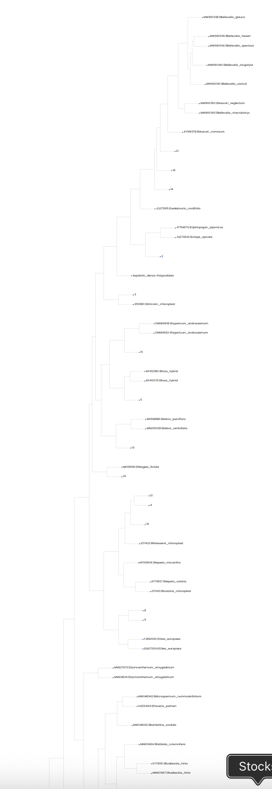

# Day 5 — DNA Subway Analysis and Phylogenetic Trees

## What I Learned

On Day 5, I learned how DNA sequence data can be analyzed using bioinformatics to investigate the identity and relationships of organisms.

We used DNA Subway, a bioinformatics platform for DNA barcoding and sequence analysis. I learned how our DNA sequences could be compared with reference sequences from known organisms and displayed as phylogenetic trees.

I also learned how to interpret a phylogenetic tree. Samples that cluster close together have more similar DNA sequences, while samples separated by more branches are less similar.

## Analysis

We analyzed DNA sequences from both plant and ant samples using DNA Subway.

For the plant dataset, our numbered samples were compared with reference DNA sequences from known plant species. DNA Subway generated a phylogenetic tree showing where each sample was positioned relative to the reference sequences.

We then performed a similar analysis using the ant DNA sequences and compared our samples with reference sequences from known ant species.

## Methods

The general process was:

1. Obtain DNA sequence data from the samples.
2. Analyze the sequences using DNA Subway.
3. Compare our sequences with reference sequences from known organisms.
4. Generate phylogenetic trees.
5. Locate our numbered samples on the trees.
6. Examine which reference sequences were closest to each sample.
7. Interpret possible identities and relationships based on the branching patterns.

## Results

### Plant Phylogenetic Tree

The plant phylogenetic tree contained our numbered samples together with reference DNA sequences from many known plant species.

Our samples were distributed throughout different parts of the tree rather than forming a single cluster. They appeared near reference sequences from several different plant groups, including `Bellevalia`, `Muscari`, `Rosa`, `Malva`, `Nepeta`, `Artemisia`, and `Achillea`.

Because the phylogenetic tree was very long, I saved it as two images.

Looking at the tree helped me see how an unknown DNA sequence can be placed among reference sequences from known organisms. Instead of looking only at the name of the closest reference, I could examine the overall branching pattern and which sequences grouped together.

### Ant Phylogenetic Tree

We also generated a phylogenetic tree using the ant DNA sequences.

The numbered samples were compared with reference sequences from several known ant groups, including `Tetramorium`, `Lasius`, and `Camponotus`.

Some samples appeared close to particular reference groups, while others were positioned in less obvious locations on the tree.

The ant tree also contained some unexpected non-ant reference sequences. This showed me that DNA sequence analysis does not always produce a simple identification and that unusual results need to be examined carefully.

## What I Learned From the Results

From these results, I learned that identifying an organism using DNA involves more than simply obtaining its DNA sequence.

The sequence first needs to be compared with reference sequences from known organisms. A phylogenetic tree then provides a visual way to examine similarities and possible relationships between sequences.

If an unknown sample clusters close to reference sequences from a particular species or group, this can provide evidence about its possible identity. However, being close on a tree does not automatically prove that the sample belongs to exactly that species.

Sequence quality, contamination, the available reference sequences, and the method used to construct the tree can all affect the result.

I therefore learned that a phylogenetic tree is something that needs to be interpreted rather than simply read as a final answer.

## Connection to the Previous Days

Day 5 helped connect all of the experiments we had performed throughout the workshop.

The overall process was:

`Biological Sample → DNA Extraction → PCR → Gel Electrophoresis → DNA Sequencing → DNA Subway → Phylogenetic Tree → Biological Interpretation`

At the beginning of the workshop, we were working with physical biological samples. By the final day, those samples had become digital DNA sequence data that we could analyze on a computer.

This helped me understand how experimental biology and bioinformatics are connected.

## Reflection

Day 5 was one of the most interesting parts of the workshop because I could finally see what happens to DNA after it has been extracted, amplified, and sequenced.

Instead of only performing laboratory procedures, I was able to use DNA sequence data to investigate biological questions.

I especially liked seeing our own numbered samples appear among reference sequences from known organisms on the phylogenetic trees. It made the connection between our laboratory experiments and the final computational analysis much clearer.

I also learned that biological data are not always perfectly clear. Some samples grouped closely with known organisms, while others were more difficult to interpret. Learning how to think about uncertain or unexpected results was an important part of the analysis.
